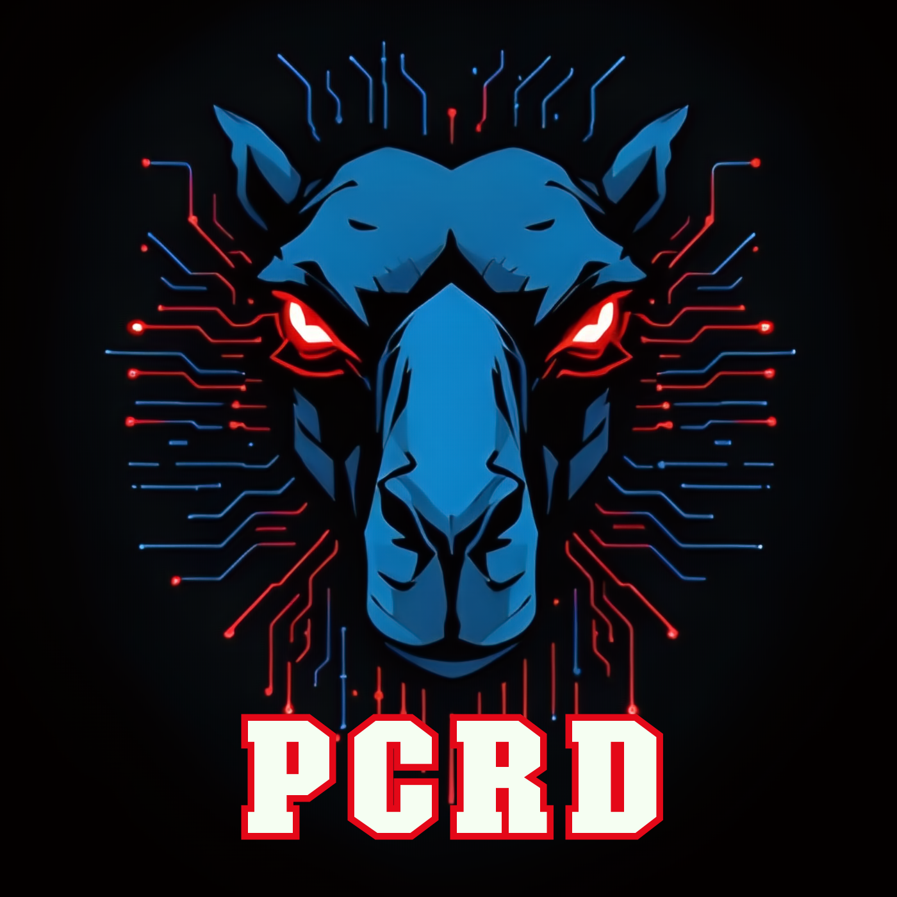

    

# Parameters Control and Reporting Daemon
A Perl module to control local desktop environment. It is supposed to be used
together with WMs that do not provide DE-like features like brightness control
(like dwm).

This module is mostly for self-use. Let me know if you are interested in using
it yourself.

## Code and documentation
Code on GitHub. Documentation as a man page - see `man PCRD`, `man pcrd` and
`man pcrctl`.

## TODO

- extra monitors through xrandr

## Bugs and feature requests
Please use the Github's issue tracker to file both bugs and feature requests.

## Contributions
Contributions to the project in form of Github's pull requests are
welcome. Please make sure your code is in line with the general
coding style of the module. Let me know if you plan something
bigger so we can talk it through.

### Author
Bartosz Jarzyna <bbrtj.pro@gmail.com>

